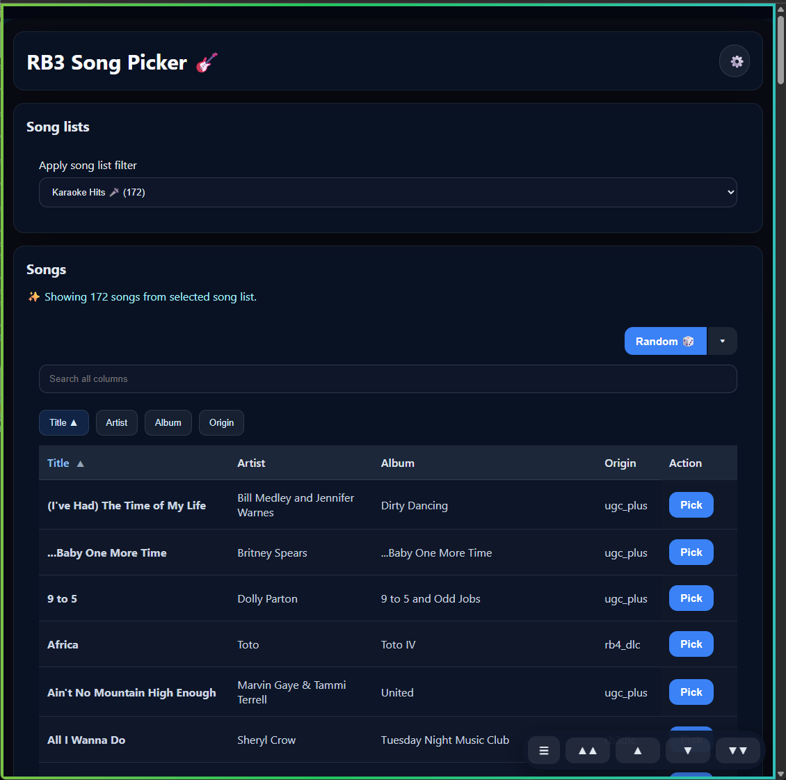

# 🎸 RB3 Song Picker

> Level up your Rock Band 3 parties! 🎉🥁🎤

Tired of scrolling through hundreds of songs mid-party while your friends are waiting? **RB3 Song Picker** is your party DJ sidekick — a slick web app that lets you and your crew browse, search, and queue up Rock Band 3 songs from any phone or laptop on the same Wi-Fi. No more hogging the TV menu!

## 🎮 For party hosts & players

### What can you do with it?

- 🎵 **Browse your full song library** from your phone, tablet, or laptop — no need to touch the Xbox at all.
- 🔍 **Search songs instantly** by title, artist, album, or origin — find that one song in seconds.
- 📋 **Create custom song lists** — build a setlist for your party (e.g. "80s Night 🕺", "Karaoke Hits 🎤", "Hard mode only 💀"). Switch between them on the fly.
- 🎲 **Pick a random song** — feeling adventurous? Hit the random button! You can even pick *random unpopular* (discover hidden gems) or *random popular* (crowd-pleasers only). Random picks also work within a specific song list!
- 📊 **Sort your library** by title, artist, album or origin.
- ✏️ **Edit and delete your song lists** — tweak your setlist anytime.
- 📈 **Pick counts** — every time a song gets picked, it's tracked. See what the crowd loves most!
- 📱 **Works on any device** — the UI is fully mobile-friendly. Everyone at the party can connect simultaneously and use it on their own phone.
- ⚡ **Works even when the Xbox is off** — browse your cached library, manage song lists, and prepare setlists without the console being on.

### 🎉 One library, everyone benefits

The host loads the song library once — that's it. Every friend who connects instantly sees the full library and all the custom song lists you've created. No setup on their end, no duplicated work. Your "Karaoke Hits" setlist is ready for everyone the moment they join.

### 🎉 Invite your friends to join

No app install needed! Open the **Admin page** (the ⚙️ icon) and show your friends the **QR code** — they just scan it with their phone and they're in. Everyone at the party can browse songs and pick what's next!

### 🛠️ Setup (one-time, for the host)

This app runs on a PC on the same local network as your Xbox.

**What you need:**
- A Windows/Mac/Linux PC connected to the same Wi-Fi or LAN as your Xbox 360.
- [RB3Enhanced](https://github.com/RBEnhanced/RB3Enhanced) installed on the Xbox — this mod enables the Xbox HTTP server that RB3 Song Picker talks to.
- [Node.js](https://nodejs.org/) version 18 or newer installed on the PC.

> **Note:** RB3 Song Picker completely replaces the built-in web interface that comes with RB3Enhanced with its own full-featured UI.

**Steps:**
1. Open a terminal in the `RB3SongPicker` folder.
2. Run `npm install`.
3. Run `npm start`.
4. Open `http://localhost:3000` in your browser.
5. Go to the **Admin page** (⚙️), enter your Xbox's IP address and port, then hit **Refresh library** to load your songs.
6. Share the QR code with your friends!

---

## 🔧 Technical stuff

### Architecture

- Local Node.js/Express backend serving a single-page web app.
- Song library is fetched from the Xbox HTTP server (`/list_songs`) and cached locally in a SQLite database (`songs.sqlite`).
- All browser requests are proxied through the backend at `http://localhost:3000`.
- Song selection sends a `/jump?shortname=...` request to the Xbox server.

### API routes

| Method | Path | Description |
|--------|------|-------------|
| `GET` | `/api/songs` | List songs (supports search, sort, list filter, duplicate filter) |
| `POST` | `/api/songs/refresh` | Reload library from Xbox |
| `POST` | `/api/songs/:shortname/pick` | Pick a song on the Xbox and increment pick count |
| `GET/POST` | `/api/config` | Read/write Xbox IP and port |
| `GET/POST` | `/api/settings` | Read/write UI feature toggles |
| `GET/POST/DELETE` | `/api/songlists` | Manage song lists |
| `GET` | `/api/local-url` | Get the local network URL (used to generate the QR code) |

### Configuration

- Set the Xbox IP address and port in the Admin UI, or pre-configure by copying `config.example.json` to `config.json` and editing it.
- `config.json` is generated locally on first run and is excluded from version control.
- Make sure `EnableHTTPServer=true` in `rb3.ini` on the Xbox.

### Data storage

- All data is stored in `songs.sqlite` (excluded from version control).
- Songs, pick counts, custom song lists, and app settings are all stored in the local database.
- The database is created automatically on first run.

### Feature toggles (Admin page)

Some UI features are off by default and can be enabled from the Admin page:

- **Song list management** — show/hide the create/edit/delete controls for song lists.
- **Duplicate filter button** — show a button to filter songs that appear more than once in the library (useful for auditing DLC packs with overlapping content).
- **Shortname column** — show the internal song shortname in the song table.
- **Export to CSV button** — show a button to export the current visible song grid (respects active search, sort, and list filter) to a CSV file.
